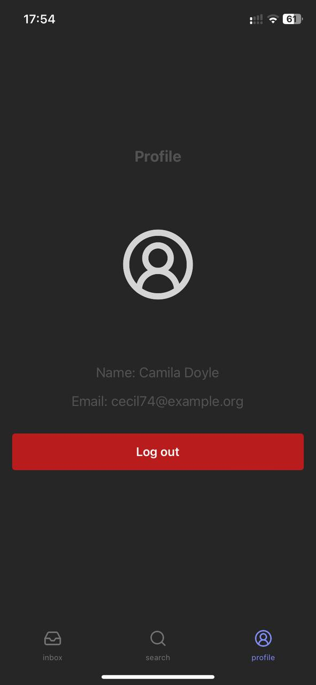

# Argo Tech TODO app

## backend

```bash
docker compose build
docker compose up
```

## test users

Caso queira testar com tarefas geradas automaticamente:

```bash
# reseta a base de dados
docker exec php artisan migrate:reset

# roda as migrations e as seeders para popular as tabelas
docker exec php artisan migrate:fresh --seed
```

Todos os usuarios criado pela seed possuem senha `12345678`.

## frontend

```bash
npm install
npm run start
```

## screenshots

### Sign In


### Sign In Loading


### Sign Up


### Profile tab



### Inbox Tab


